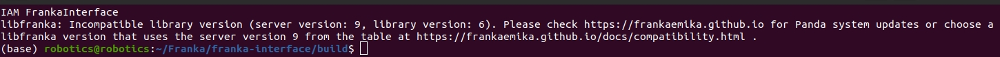

# Franka Interface
## Reference
https://github.com/iamlab-cmu/franka-interface
https://iamlab-cmu.github.io/franka-interface/index.html

## 1. Environment Setting
```
conda create -n manipulation python=3.8 -y
```
```
conda activate manipulation
```
```
conda install numpy pip -y
```
### 1. Clone the Franka-interface Repository and its Submodules:
```
cd ~/Franka
git clone --recurse-submodules https://github.com/ChangerC77/franka-interface.git
cd franka-interface
```
### 2. If you are using a Franka Research 3, you should use the following command:
```
bash ./bash_scripts/clone_libfranka.sh 6
```



修改内容：第18行，将`git commit` 改为`0.15.0`
```
sudo vim ./bash_scripts/clone_libfranka.sh
```

```
firmware_version=$1

valid_version=true
case $firmware_version in
2)
  commit=5ca631e
  ;;
3)
  commit=80197c6
  ;;
4)
  commit=f1f46fb
  ;;
5)
  commit=83e931c
  ;;
6)
  commit=0.15.0
  ;;
*)
  valid_version=false
  echo "Please enter your robot's firmware version as 2, 3, 4, 5, or 6."
  ;;
esac

if [ "$valid_version" = true ] ; then
  rm -rf libfranka
  git clone https://github.com/frankaemika/libfranka.git
  cd libfranka
  git checkout $commit
  git submodule update --init --recursive
fi
```
In addition, if you are using a Franka Research 3, you should go to the following file (`franka-interface/include/franka-interface/termination_handler/termination_handler.h`) and `comment lines 97 and 98` and `uncomment lines 102 and 103`:
```
sudo vim franka-interface/include/franka-interface/termination_handler/termination_handler.h
```
```c++
// Franka Panda Joint Limits from https://frankaemika.github.io/docs/control_parameters.html
const std::array<double, 7> max_joint_limits_ = std::array<double, 7>{2.88, 1.75, 2.88, -0.06, 2.88, 3.74, 2.88};
const std::array<double, 7> min_joint_limits_ = std::array<double, 7>{-2.88, -1.75, -2.88, -3.06, -2.88, -0.0025, -2.88};

// Comment the 2 lines above and uncomment the 2 lines below if you are using a Franka Research 3
// Franka Research 3 Joint Limits from https://frankaemika.github.io/docs/control_parameters.html
// const std::array<double, 7> max_joint_limits_ = std::array<double, 7>{2.73, 1.77, 2.88, -0.14, 2.79, 4.5, 3.0};
// const std::array<double, 7> min_joint_limits_ = std::array<double, 7>{-2.73, -1.77, -2.88, -3.03, -2.79, 0.53, -3.0};
```
### 3. Build LibFranka
```
bash ./bash_scripts/make_libfranka.sh
```
If you have the `franka research 3` and ran the command clone_libfranka.sh with the `number 6`, you should follow the additional commands:
```
cd libfranka/build
sudo make install
cd ../../catkin_ws/src/
git clone https://github.com/frankaemika/franka_ros.git
cd franka_ros
git checkout 0.10.0
cd ../../../
```
### 4. Build franka-interface
```
bash ./bash_scripts/make_franka_interface.sh
```
#### bug
```
-- Found Boost: /home/robotics/miniconda3/envs/manipulation/lib/cmake/Boost-1.86.0/BoostConfig.cmake (found version "1.86.0") found components: program_options 
-- Found Boost: /home/robotics/miniconda3/envs/manipulation/lib/cmake/Boost-1.86.0/BoostConfig.cmake (found version "1.86.0") found components: filesystem system thread 
-- Configuring done
CMake Warning at CMakeLists.txt:24 (add_executable):
  Cannot generate a safe runtime search path for target franka_interface
  because files in some directories may conflict with libraries in implicit
  directories:

    runtime library [libz.so.1] in /usr/lib/x86_64-linux-gnu may be hidden by files in:
      /home/robotics/miniconda3/envs/manipulation/lib

  Some of these libraries may not be found correctly.


CMake Warning at franka-interface/CMakeLists.txt:30 (add_library):
  Cannot generate a safe runtime search path for target franka-interface
  because files in some directories may conflict with libraries in implicit
  directories:

    runtime library [libz.so.1] in /usr/lib/x86_64-linux-gnu may be hidden by files in:
      /home/robotics/miniconda3/envs/manipulation/lib

  Some of these libraries may not be found correctly.


-- Generating done
-- Build files have been written to: /home/robotics/Franka/franka-interface/build
[  3%] Built target franka-interface-common
[ 10%] Built target proto
[ 27%] Built target franka
[ 28%] Built target examples_common
[ 30%] Built target print_joint_poses
[ 32%] Built target vacuum_object
[ 33%] Built target grasp_object
[ 35%] Built target echo_robot_state
[ 36%] Built target force_control
[ 37%] Built target generate_elbow_motion
[ 38%] Built target communication_test
[ 40%] Built target joint_point_to_point_motion
[ 41%] Built target cartesian_impedance_control
[ 42%] Built target motion_with_control
[ 44%] Built target generate_joint_velocity_motion
[ 45%] Built target generate_cartesian_velocity_motion
[ 47%] Built target generate_cartesian_pose_motion
[ 48%] Built target joint_impedance_control
[ 49%] Built target generate_joint_position_motion
[ 51%] Built target generate_consecutive_motions
[ 99%] Built target franka-interface
[ 99%] Linking CXX executable franka_interface
/usr/bin/ld: /home/robotics/miniconda3/envs/manipulation/lib/libboost_program_options.so.1.86.0: undefined reference to `std::ios_base_library_init()@GLIBCXX_3.4.32'
/usr/bin/ld: /home/robotics/miniconda3/envs/manipulation/lib/libboost_program_options.so.1.86.0: undefined reference to `std::__cxx11::basic_string<char, std::char_traits<char>, std::allocator<char> >::_M_replace_cold(char*, unsigned long, char const*, unsigned long, unsigned long)@GLIBCXX_3.4.31'
/usr/bin/ld: /home/robotics/miniconda3/envs/manipulation/lib/libboost_program_options.so.1.86.0: undefined reference to `std::__throw_bad_array_new_length()@GLIBCXX_3.4.29'
/usr/bin/ld: /home/robotics/miniconda3/envs/manipulation/lib/libboost_program_options.so.1.86.0: undefined reference to `std::__cxx11::basic_string<wchar_t, std::char_traits<wchar_t>, std::allocator<wchar_t> >::_M_replace_cold(wchar_t*, unsigned long, wchar_t const*, unsigned long, unsigned long)@GLIBCXX_3.4.31'
collect2: error: ld returned 1 exit status
make[2]: *** [CMakeFiles/franka_interface.dir/build.make:96：franka_interface] 错误 1
make[1]: *** [CMakeFiles/Makefile2:234：CMakeFiles/franka_interface.dir/all] 错误 2
make: *** [Makefile:152：all] 错误 2
```
从错误信息来看，链接器报错的原因是 Boost 库（libboost_program_options.so.1.86.0）依赖的 GLIBCXX 版本与系统的标准库版本（libstdc++）不匹配。具体问题是，Boost 库需要的符号（如 std::__cxx11::basic_string 和 std::ios_base_library_init）在当前的 libstdc++ 中不存在。
这是一个常见的 ABI（Application Binary Interface）兼容性问题，通常是因为编译器或标准库版本不一致导致的。
##### 1. 检查 libstdc++ 版本
运行以下命令，检查当前系统的 `libstdc++` 版本是否支持所需的符号：
```
strings /usr/lib/x86_64-linux-gnu/libstdc++.so.6 | grep GLIBCXX
```
`查看是否包含 `GLIBCXX_3.4.29`、`GLIBCXX_3.4.31` 和 `G`LIBCXX_3.4.32`。
- 如果这些版本缺失，则需要更新 `libstdc++`。
- 如果这些版本已存在，则可能是链接过程未正确使用系统的 `libstdc++`。
发现不包含，需要更新
##### 2. 升级 libstdc++
如果系统中的 libstdc++ 版本过低，可以尝试升级。以下是升级步骤：
```
sudo apt update
sudo apt install libstdc++6
```
如果你的系统不支持更高版本的 `libstdc++`（例如在旧版 Ubuntu 上），可以手动下载并安装更高版本：
```
sudo add-apt-repository ppa:ubuntu-toolchain-r/test
sudo apt update
sudo apt install libstdc++6
```
再次运行以下命令，验证升级成功：
```
strings /usr/lib/x86_64-linux-gnu/libstdc++.so.6 | grep GLIBCXX
```
## 2. Enter the franka virtual environment (Virtual Environment) and then run the following commands:
`ros noetic`需要的`empy`版本为`3.3.4`
```
pip install catkin-tools empy==3.3.4
bash ./bash_scripts/make_catkin.sh
```
output
```
Profile:                     default
Extending:          [cached] /opt/ros/noetic
Workspace:                   /home/robotics/Franka/franka-interface/catkin_ws
-------------------------------------------------------------------------------------
Build Space:        [exists] /home/robotics/Franka/franka-interface/catkin_ws/build
Devel Space:        [exists] /home/robotics/Franka/franka-interface/catkin_ws/devel
Install Space:      [unused] /home/robotics/Franka/franka-interface/catkin_ws/install
Log Space:          [exists] /home/robotics/Franka/franka-interface/catkin_ws/logs
Source Space:       [exists] /home/robotics/Franka/franka-interface/catkin_ws/src
DESTDIR:            [unused] None
-------------------------------------------------------------------------------------
Devel Space Layout:          linked
Install Space Layout:        None
-------------------------------------------------------------------------------------
Additional CMake Args:       None
Additional Make Args:        None
Additional catkin Make Args: None
Internal Make Job Server:    True
Cache Job Environments:      False
-------------------------------------------------------------------------------------
Buildlisted Packages:        None
Skiplisted Packages:         None
-------------------------------------------------------------------------------------
Workspace configuration appears valid.
-------------------------------------------------------------------------------------
[build] Found 10 packages in 0.0 seconds.                                                                                                                                                                 
[build] Updating package table.                                                                                                                                                                           
Starting  >>> franka_description                                                                                                                                                                          
Starting  >>> franka_gripper                                                                                                                                                                              
Starting  >>> franka_interface_msgs                                                                                                                                                                       
Starting  >>> franka_msgs                                                                                                                                                                                 
Finished  <<< franka_description                        [ 0.1 seconds ]                                                                                                                                   
Starting  >>> franka_visualization                                                                                                                                                                        
Finished  <<< franka_interface_msgs                     [ 0.7 seconds ]                                                                                                                                   
Starting  >>> franka_ros_interface                                                                                                                                                                        
Finished  <<< franka_msgs                               [ 0.6 seconds ]                                                                                                                                   
Starting  >>> franka_hw                                                                                                                                                                                   
Finished  <<< franka_visualization                      [ 0.5 seconds ]                                                                                                                                   
Finished  <<< franka_gripper                            [ 0.9 seconds ]                                                                                                                                   
Finished  <<< franka_ros_interface                      [ 0.4 seconds ]                                                                                                                                   
Finished  <<< franka_hw                                 [ 0.3 seconds ]                                                                                                                                   
Starting  >>> franka_control                                                                                                                                                                              
Finished  <<< franka_control                            [ 0.3 seconds ]                                                                                                                                   
Starting  >>> franka_example_controllers                                                                                                                                                                  
Finished  <<< franka_example_controllers                [ 0.4 seconds ]                                                                                                                                   
Starting  >>> franka_ros                                                                                                                                                                                  
Finished  <<< franka_ros                                [ 1.1 seconds ]                                                                                                                                   
[build] Summary: All 10 packages succeeded!                                                                                                                                                               
[build]   Ignored:   None.                                                                                                                                                                                
[build]   Warnings:  None.                                                                                                                                                                                
[build]   Abandoned: None.                                                                                                                                                                                
[build]   Failed:    None.                                                                                                                                                                                
[build] Runtime: 3.1 seconds total.                                                                                                                                                                       
[build] Note: Workspace packages have changed, please re-source setup files to use them.
```
### bug 1
直接`pip install empy`装的，版本与`noetic`所需要的`3.3.4`不符合
```
rrors     << franka_interface_msgs:make /home/robotics/Franka/franka-interface/catkin_ws/logs/franka_interface_msgs/build.make.000.log                                                                   
Traceback (most recent call last):
  File "/opt/ros/noetic/share/gencpp/cmake/../../../lib/gencpp/gen_cpp.py", line 49, in <module>
    genmsg.template_tools.generate_from_command_line_options(
  File "/opt/ros/noetic/lib/python3/dist-packages/genmsg/template_tools.py", line 213, in generate_from_command_line_options
    generate_from_file(argv[1], options.package, options.outdir, options.emdir, options.includepath, msg_template_dict, srv_template_dict)
  File "/opt/ros/noetic/lib/python3/dist-packages/genmsg/template_tools.py", line 154, in generate_from_file
    _generate_msg_from_file(input_file, output_dir, template_dir, search_path, package_name, msg_template_dict)
  File "/opt/ros/noetic/lib/python3/dist-packages/genmsg/template_tools.py", line 93, in _generate_msg_from_file
    _generate_from_spec(input_file,
  File "/opt/ros/noetic/lib/python3/dist-packages/genmsg/template_tools.py", line 77, in _generate_from_spec
    interpreter = em.Interpreter(output=ofile, globals=g, options={em.RAW_OPT:True,em.BUFFERED_OPT:True})
AttributeError: module 'em' has no attribute 'RAW_OPT'
make[2]: *** [CMakeFiles/franka_interface_msgs_generate_messages_cpp.dir/build.make:77：/home/robotics/Franka/franka-interface/catkin_ws/devel/.private/franka_interface_msgs/include/franka_interface_msgs/Errors.h] 错误 1
make[2]: *** 正在删除文件“/home/robotics/Franka/franka-interface/catkin_ws/devel/.private/franka_interface_msgs/include/franka_interface_msgs/Errors.h”
make[2]: *** 正在等待未完成的任务....
Traceback (most recent call last):
  File "/opt/ros/noetic/share/gencpp/cmake/../../../lib/gencpp/gen_cpp.py", line 49, in <module>
    genmsg.template_tools.generate_from_command_line_options(
  File "/opt/ros/noetic/lib/python3/dist-packages/genmsg/template_tools.py", line 213, in generate_from_command_line_options
    generate_from_file(argv[1], options.package, options.outdir, options.emdir, options.includepath, msg_template_dict, srv_template_dict)
  File "/opt/ros/noetic/lib/python3/dist-packages/genmsg/template_tools.py", line 154, in generate_from_file
    _generate_msg_from_file(input_file, output_dir, template_dir, search_path, package_name, msg_template_dict)
  File "/opt/ros/noetic/lib/python3/dist-packages/genmsg/template_tools.py", line 93, in _generate_msg_from_file
    _generate_from_spec(input_file,
  File "/opt/ros/noetic/lib/python3/dist-packages/genmsg/template_tools.py", line 77, in _generate_from_spec
    interpreter = em.Interpreter(output=ofile, globals=g, options={em.RAW_OPT:True,em.BUFFERED_OPT:True})
AttributeError: module 'em' has no attribute 'RAW_OPT'
make[2]: *** [CMakeFiles/franka_interface_msgs_generate_messages_cpp.dir/build.make:84：/home/robotics/Franka/franka-interface/catkin_ws/devel/.private/franka_interface_msgs/include/franka_interface_msgs/FrankaInterfaceStatus.h] 错误 1
make[2]: *** 正在删除文件“/home/robotics/Franka/franka-interface/catkin_ws/devel/.private/franka_interface_msgs/include/franka_interface_msgs/FrankaInterfaceStatus.h”
make[1]: *** [CMakeFiles/Makefile2:1550：CMakeFiles/franka_interface_msgs_generate_messages_cpp.dir/all] 错误 2
make[1]: *** 正在等待未完成的任务....
make: *** [Makefile:141：all] 错误 2

```
### bug 2
```
/home/robotics/Franka/franka-interface/catkin_ws/logs/franka_example_controllers/build.make.000.log
 Traceback (most recent call last):
 File "/home/robotics/Franka/franka-interface/catkin_ws/src/franka_ros/franka_example_controllers/cfg/compliance_param.cfg", line 4, in <module>
 from dynamic_reconfigure.parameter_generator_catkin import *
 File "/opt/ros/noetic/lib/python3/dist-packages/dynamic_reconfigure/init.py", line 38, in <module>
 import roslib
 File "/opt/ros/noetic/lib/python3/dist-packages/roslib/init.py", line 50, in <module>
 from roslib.launcher import load_manifest  # noqa: F401
 File "/opt/ros/noetic/lib/python3/dist-packages/roslib/launcher.py", line 42, in <module>
 import rospkg
 ModuleNotFoundError: No module named 'rospkg'
 Traceback (most recent call last):
 File "/home/robotics/Franka/franka-interface/catkin_ws/src/franka_ros/franka_example_controllers/cfg/teleop_gripper_param.cfg", line 4, in <module>
 from dynamic_reconfigure.parameter_generator_catkin import *
 File "/opt/ros/noetic/lib/python3/dist-packages/dynamic_reconfigure/init.py", line 38, in <module>
 import roslib
 File "/opt/ros/noetic/lib/python3/dist-packages/roslib/init.py", line 50, in <module>
 from roslib.launcher import load_manifest  # noqa: F401
 File "/opt/ros/noetic/lib/python3/dist-packages/roslib/launcher.py", line 42, in <module>
 import rospkg
 ModuleNotFoundError: No module named 'rospkg'
 make[2]: *** [CMakeFiles/franka_example_controllers_gencfg.dir/build.make:72：/home/robotics/Franka/franka-interface/catkin_ws/devel/.private/franka_example_controllers/include/franka_example_controllers/compliance_paramConfig.h] 错误 1
 make[2]: *** 正在等待未完成的任务....
 Traceback (most recent call last):
 File "/home/robotics/Franka/franka-interface/catkin_ws/src/franka_ros/franka_example_controllers/cfg/teleop_param.cfg", line 4, in <module>
 from dynamic_reconfigure.parameter_generator_catkin import *
 File "/opt/ros/noetic/lib/python3/dist-packages/dynamic_reconfigure/init.py", line 38, in <module>
 import roslib
 File "/opt/ros/noetic/lib/python3/dist-packages/roslib/init.py", line 50, in <module>
 from roslib.launcher import load_manifest  # noqa: F401
 File "/opt/ros/noetic/lib/python3/dist-packages/roslib/launcher.py", line 42, in <module>
 import rospkg
 ModuleNotFoundError: No module named 'rospkg'
 make[2]: *** [CMakeFiles/franka_example_controllers_gencfg.dir/build.make:144：/home/robotics/Franka/franka-interface/catkin_ws/devel/.private/franka_example_controllers/include/franka_example_controllers/teleop_gripper_paramConfig.h] 错误 1
 make[2]: *** [CMakeFiles/franka_example_controllers_gencfg.dir/build.make:126：/home/robotics/Franka/franka-interface/catkin_ws/devel/.private/franka_example_controllers/include/franka_example_controllers/teleop_paramConfig.h] 错误 1
 Traceback (most recent call last):
 File "/home/robotics/Franka/franka-interface/catkin_ws/src/franka_ros/franka_example_controllers/cfg/dual_arm_compliance_param.cfg", line 4, in <module>
 from dynamic_reconfigure.parameter_generator_catkin import *
 File "/opt/ros/noetic/lib/python3/dist-packages/dynamic_reconfigure/init.py", line 38, in <module>
 import roslib
 File "/opt/ros/noetic/lib/python3/dist-packages/roslib/init.py", line 50, in <module>
 from roslib.launcher import load_manifest  # noqa: F401
 File "/opt/ros/noetic/lib/python3/dist-packages/roslib/launcher.py", line 42, in <module>
 import rospkg
 ModuleNotFoundError: No module named 'rospkg'
 make[2]: *** [CMakeFiles/franka_example_controllers_gencfg.dir/build.make:108：/home/robotics/Franka/franka-interface/catkin_ws/devel/.private/franka_example_controllers/include/franka_example_controllers/dual_arm_compliance_paramConfig.h] 错误 1
 Traceback (most recent call last):
 File "/home/robotics/Franka/franka-interface/catkin_ws/src/franka_ros/franka_example_controllers/cfg/desired_mass_param.cfg", line 4, in <module>
 from dynamic_reconfigure.parameter_generator_catkin import *
 File "/opt/ros/noetic/lib/python3/dist-packages/dynamic_reconfigure/init.py", line 38, in <module>
 import roslib
 File "/opt/ros/noetic/lib/python3/dist-packages/roslib/init.py", line 50, in <module>
 from roslib.launcher import load_manifest  # noqa: F401
 File "/opt/ros/noetic/lib/python3/dist-packages/roslib/launcher.py", line 42, in <module>
 import rospkg
 ModuleNotFoundError: No module named 'rospkg'
 make[2]: *** [CMakeFiles/franka_example_controllers_gencfg.dir/build.make:90：/home/robotics/Franka/franka-interface/catkin_ws/devel/.private/franka_example_controllers/include/franka_example_controllers/desired_mass_paramConfig.h] 错误 1
 make[1]: *** [CMakeFiles/Makefile2:2873：CMakeFiles/franka_example_controllers_gencfg.dir/all] 错误 2
 make[1]: *** 正在等待未完成的任务....
 make: *** [Makefile:141：all] 错误 2
 ```
这是由于 缺少 `rospkg` Python 模块 导致的。`rospkg` 是 ROS Python 工具链的一部分，用于支持动态重配置（dynamic_reconfigure）等功能。

```
pip3 install rospkg
```
```
sudo apt install python3-rosdep python3-catkin-tools python3-rosinstall python3-rosinstall-generator python3-wstool python3-empy python3-rospkg-modules python3-rospy
```
### bug 3
https://github.com/iamlab-cmu/franka-interface/issues/21

这里是因为ros gazebo支持的protobuf和安装的版本不匹配
#### solution
需要在`src`中把`gazebo`的`package`删掉
```
/usr/include/ignition/msgs5/ignition/msgs/MessageTypes.hh:195,
 from /usr/include/ignition/msgs5/ignition/msgs/Utility.hh:33,
 from /usr/include/ignition/msgs5/ignition/msgs.hh:29,
 from /usr/include/ignition/transport8/gz/transport/Node.hh:33,
 from /usr/include/ignition/transport8/ignition/transport/Node.hh:18,
 from /usr/include/gazebo-11/gazebo/physics/Entity.hh:25,
 from /usr/include/gazebo-11/gazebo/physics/Model.hh:30,
 from /usr/include/gazebo-11/gazebo/physics/Actor.hh:30,
 from /usr/include/gazebo-11/gazebo/physics/physics.hh:2,
 from /opt/ros/noetic/include/gazebo_ros_control/robot_hw_sim.h:45,
 from /home/robotics/Franka/franka-interface/catkin_ws/src/franka_ros/franka_gazebo/include/franka_gazebo/franka_hw_sim.h:12,
 from /home/robotics/Franka/franka-interface/catkin_ws/src/franka_ros/franka_gazebo/src/franka_hw_sim.cpp:6:
 /usr/include/ignition/msgs5/ignition/msgs/visual_v.pb.h: At global scope:
 /usr/include/ignition/msgs5/ignition/msgs/visual_v.pb.h:55:46: error: ‘FieldMetadata’ in namespace ‘google::protobuf::internal’ does not name a type; did you mean ‘AnyMetadata’?
 55 |   static const ::google::protobuf::internal::FieldMetadata field_metadata[];
 |                                              ^~~~~~~~~~~~~
 |                                              AnyMetadata
 /usr/include/ignition/msgs5/ignition/msgs/visual_v.pb.h:56:46: error: ‘SerializationTable’ in namespace ‘google::protobuf::internal’ does not name a type
 56 |   static const ::google::protobuf::internal::SerializationTable serialization_table[];
 |                                              ^~~~~~~~~~~~~~~~~~
 In file included from /usr/include/ignition/msgs5/ignition/msgs/MessageTypes.hh:195,
 from /usr/include/ignition/msgs5/ignition/msgs/Utility.hh:33,
 from /usr/include/ignition/msgs5/ignition/msgs.hh:29,
 from /usr/include/ignition/transport8/gz/transport/Node.hh:33,
 from /usr/include/ignition/transport8/ignition/transport/Node.hh:18,
 from /usr/include/gazebo-11/gazebo/physics/Entity.hh:25,
 from /usr/include/gazebo-11/gazebo/physics/Model.hh:30,
 from /usr/include/gazebo-11/gazebo/physics/Actor.hh:30,
 from /usr/include/gazebo-11/gazebo/physics/physics.hh:2,
 from /opt/ros/noetic/include/gazebo_ros_control/robot_hw_sim.h:45,
 from /home/robotics/Franka/franka-interface/catkin_ws/src/franka_ros/franka_gazebo/include/franka_gazebo/franka_hw_sim.h:12,
 from /home/robotics/Franka/franka-interface/catkin_ws/src/franka_ros/franka_gazebo/src/franka_hw_sim.cpp:6:
 /usr/include/ignition/msgs5/ignition/msgs/visual_v.pb.h:192:33: error: ‘InternalMetadataWithArena’ in namespace ‘google::protobuf::internal’ does not name a type; did you mean ‘InternalMetadata’?
 192 |   ::google::protobuf::internal::InternalMetadataWithArena internal_metadata;
 |                                 ^~~~~~~~~~~~~~~~~~~~~~~~~
 |                                 InternalMetadata
 /usr/include/ignition/msgs5/ignition/msgs/visual_v.pb.h:122:20: error: ‘ignition::msgs::Visual_V* ignition::msgs::Visual_V::New() const’ marked ‘final’, but is not virtual
 122 |   inline Visual_V* New() const final {
 |                    ^~~
 /usr/include/ignition/msgs5/ignition/msgs/visual_v.pb.h:129:8: error: ‘void ignition::msgs::Visual_V::CopyFrom(const google::protobuf::Message&)’ marked ‘final’, but is not virtual
 129 |   void CopyFrom(const ::google::protobuf::Message& from) final;
 |        ^~~~~~~~
 /usr/include/ignition/msgs5/ignition/msgs/visual_v.pb.h:137:8: error: ‘bool ignition::msgs::Visual_V::MergePartialFromCodedStream(google::protobuf::io::CodedInputStream*)’ marked ‘final’, but is not virtual
 137 |   bool MergePartialFromCodedStream(
 |        ^~~~~~~~~~~~~~~~~~~~~~~~~~~
 /usr/include/ignition/msgs5/ignition/msgs/visual_v.pb.h:139:8: error: ‘void ignition::msgs::Visual_V::SerializeWithCachedSizes(google::protobuf::io::CodedOutputStream*) const’ marked ‘final’, but is not virtual
 139 |   void SerializeWithCachedSizes(
 |        ^~~~~~~~~~~~~~~~~~~~~~~~
 /usr/include/ignition/msgs5/ignition/msgs/visual_v.pb.h:141:30: error: ‘google::protobuf::uint8* ignition::msgs::Visual_V::InternalSerializeWithCachedSizesToArray(bool, google::protobuf::uint8*) const’ marked ‘final’, but is not virtual
 141 |   ::google::protobuf::uint8* InternalSerializeWithCachedSizesToArray(
 |                              ^~~~~~~~~~~~~~~~~~~~~~~~~~~~~~~~~~~~~~~
 In file included from /usr/include/ignition/msgs5/ignition/msgs/MessageTypes.hh:197,
 from /usr/include/ignition/msgs5/ignition/msgs/Utility.hh:33,
 from /usr/include/ignition/msgs5/ignition/msgs.hh:29,
 from /usr/include/ignition/transport8/gz/transport/Node.hh:33,
 from /usr/include/ignition/transport8/ignition/transport/Node.hh:18,
 from /usr/include/gazebo-11/gazebo/physics/Entity.hh:25,
 from /usr/include/gazebo-11/gazebo/physics/Model.hh:30,
 from /usr/include/gazebo-11/gazebo/physics/Actor.hh:30,
 from /usr/include/gazebo-11/gazebo/physics/physics.hh:2,
 from /opt/ros/noetic/include/gazebo_ros_control/robot_hw_sim.h:45,
 from /home/robotics/Franka/franka-interface/catkin_ws/src/franka_ros/franka_gazebo/include/franka_gazebo/franka_hw_sim.h:12,
 from /home/robotics/Franka/franka-interface/catkin_ws/src/franka_ros/franka_gazebo/src/franka_hw_sim.cpp:6:
 /usr/include/ignition/msgs5/ignition/msgs/wind.pb.h:55:46: error: ‘FieldMetadata’ in namespace ‘google::protobuf::internal’ does not name a type; did you mean ‘AnyMetadata’?
 55 |   static const ::google::protobuf::internal::FieldMetadata field_metadata[];
 |                                              ^~~~~~~~~~~~~
 |                                              AnyMetadata
 /usr/include/ignition/msgs5/ignition/msgs/wind.pb.h:56:46: error: ‘SerializationTable’ in namespace ‘google::protobuf::internal’ does not name a type
 56 |   static const ::google::protobuf::internal::SerializationTable serialization_table[];
 |                                              ^~~~~~~~~~~~~~~~~~
 In file included from /usr/include/ignition/msgs5/ignition/msgs/MessageTypes.hh:197,
 from /usr/include/ignition/msgs5/ignition/msgs/Utility.hh:33,
 from /usr/include/ignition/msgs5/ignition/msgs.hh:29,
 from /usr/include/ignition/transport8/gz/transport/Node.hh:33,
 from /usr/include/ignition/transport8/ignition/transport/Node.hh:18,
 from /usr/include/gazebo-11/gazebo/physics/Entity.hh:25,
 from /usr/include/gazebo-11/gazebo/physics/Model.hh:30,
 from /usr/include/gazebo-11/gazebo/physics/Actor.hh:30,
 from /usr/include/gazebo-11/gazebo/physics/physics.hh:2,
 from /opt/ros/noetic/include/gazebo_ros_control/robot_hw_sim.h:45,
 from /home/robotics/Franka/franka-interface/catkin_ws/src/franka_ros/franka_gazebo/include/franka_gazebo/franka_hw_sim.h:12,
 from /home/robotics/Franka/franka-interface/catkin_ws/src/franka_ros/franka_gazebo/src/franka_hw_sim.cpp:6:
 /usr/include/ignition/msgs5/ignition/msgs/wind.pb.h:198:33: error: ‘InternalMetadataWithArena’ in namespace ‘google::protobuf::internal’ does not name a type; did you mean ‘InternalMetadata’?
 198 |   ::google::protobuf::internal::InternalMetadataWithArena internal_metadata;
 |                                 ^~~~~~~~~~~~~~~~~~~~~~~~~
 |                                 InternalMetadata
 /usr/include/ignition/msgs5/ignition/msgs/wind.pb.h:122:16: error: ‘ignition::msgs::Wind* ignition::msgs::Wind::New() const’ marked ‘final’, but is not virtual
 122 |   inline Wind* New() const final {
 |                ^~~
 /usr/include/ignition/msgs5/ignition/msgs/wind.pb.h:129:8: error: ‘void ignition::msgs::Wind::CopyFrom(const google::protobuf::Message&)’ marked ‘final’, but is not virtual
 129 |   void CopyFrom(const ::google::protobuf::Message& from) final;
 |        ^~~~~~~~
 /usr/include/ignition/msgs5/ignition/msgs/wind.pb.h:137:8: error: ‘bool ignition::msgs::Wind::MergePartialFromCodedStream(google::protobuf::io::CodedInputStream*)’ marked ‘final’, but is not virtual
 137 |   bool MergePartialFromCodedStream(
 |        ^~~~~~~~~~~~~~~~~~~~~~~~~~~
 /usr/include/ignition/msgs5/ignition/msgs/wind.pb.h:139:8: error: ‘void ignition::msgs::Wind::SerializeWithCachedSizes(google::protobuf::io::CodedOutputStream*) const’ marked ‘final’, but is not virtual
 139 |   void SerializeWithCachedSizes(
 |        ^~~~~~~~~~~~~~~~~~~~~~~~
 /usr/include/ignition/msgs5/ignition/msgs/wind.pb.h:141:30: error: ‘google::protobuf::uint8* ignition::msgs::Wind::InternalSerializeWithCachedSizesToArray(bool, google::protobuf::uint8*) const’ marked ‘final’, but is not virtual
 141 |   ::google::protobuf::uint8* InternalSerializeWithCachedSizesToArray(
 |                              ^~~~~~~~~~~~~~~~~~~~~~~~~~~~~~~~~~~~~~~
 In file included from /usr/include/ignition/msgs5/ignition/msgs/MessageTypes.hh:198,
 from /usr/include/ignition/msgs5/ignition/msgs/Utility.hh:33,
 from /usr/include/ignition/msgs5/ignition/msgs.hh:29,
 from /usr/include/ignition/transport8/gz/transport/Node.hh:33,
 from /usr/include/ignition/transport8/ignition/transport/Node.hh:18,
 from /usr/include/gazebo-11/gazebo/physics/Entity.hh:25,
 from /usr/include/gazebo-11/gazebo/physics/Model.hh:30,
 from /usr/include/gazebo-11/gazebo/physics/Actor.hh:30,
 from /usr/include/gazebo-11/gazebo/physics/physics.hh:2,
 from /opt/ros/noetic/include/gazebo_ros_control/robot_hw_sim.h:45,
 from /home/robotics/Franka/franka-interface/catkin_ws/src/franka_ros/franka_gazebo/include/franka_gazebo/franka_hw_sim.h:12,
 from /home/robotics/Franka/franka-interface/catkin_ws/src/franka_ros/franka_gazebo/src/franka_hw_sim.cpp:6:
 /usr/include/ignition/msgs5/ignition/msgs/wireless_node.pb.h:54:46: error: ‘FieldMetadata’ in namespace ‘google::protobuf::internal’ does not name a type; did you mean ‘AnyMetadata’?
 54 |   static const ::google::protobuf::internal::FieldMetadata field_metadata[];
 |                                              ^~~~~~~~~~~~~
 |                                              AnyMetadata
 /usr/include/ignition/msgs5/ignition/msgs/wireless_node.pb.h:55:46: error: ‘SerializationTable’ in namespace ‘google::protobuf::internal’ does not name a type
 55 |   static const ::google::protobuf::internal::SerializationTable serialization_table[];
 |                                              ^~~~~~~~~~~~~~~~~~
 In file included from /usr/include/ignition/msgs5/ignition/msgs/MessageTypes.hh:198,
 from /usr/include/ignition/msgs5/ignition/msgs/Utility.hh:33,
 from /usr/include/ignition/msgs5/ignition/msgs.hh:29,
 from /usr/include/ignition/transport8/gz/transport/Node.hh:33,
 from /usr/include/ignition/transport8/ignition/transport/Node.hh:18,
 from /usr/include/gazebo-11/gazebo/physics/Entity.hh:25,
 from /usr/include/gazebo-11/gazebo/physics/Model.hh:30,
 from /usr/include/gazebo-11/gazebo/physics/Actor.hh:30,
 from /usr/include/gazebo-11/gazebo/physics/physics.hh:2,
 from /opt/ros/noetic/include/gazebo_ros_control/robot_hw_sim.h:45,
 from /home/robotics/Franka/franka-interface/catkin_ws/src/franka_ros/franka_gazebo/include/franka_gazebo/franka_hw_sim.h:12,
 from /home/robotics/Franka/franka-interface/catkin_ws/src/franka_ros/franka_gazebo/src/franka_hw_sim.cpp:6:
 /usr/include/ignition/msgs5/ignition/msgs/wireless_node.pb.h:205:33: error: ‘InternalMetadataWithArena’ in namespace ‘google::protobuf::internal’ does not name a type; did you mean ‘InternalMetadata’?
 205 |   ::google::protobuf::internal::InternalMetadataWithArena internal_metadata;
 |                                 ^~~~~~~~~~~~~~~~~~~~~~~~~
 |                                 InternalMetadata
 /usr/include/ignition/msgs5/ignition/msgs/wireless_node.pb.h:121:24: error: ‘ignition::msgs::WirelessNode* ignition::msgs::WirelessNode::New() const’ marked ‘final’, but is not virtual
 121 |   inline WirelessNode* New() const final {
 |                        ^~~
 /usr/include/ignition/msgs5/ignition/msgs/wireless_node.pb.h:128:8: error: ‘void ignition::msgs::WirelessNode::CopyFrom(const google::protobuf::Message&)’ marked ‘final’, but is not virtual
 128 |   void CopyFrom(const ::google::protobuf::Message& from) final;
 |        ^~~~~~~~
 /usr/include/ignition/msgs5/ignition/msgs/wireless_node.pb.h:136:8: error: ‘bool ignition::msgs::WirelessNode::MergePartialFromCodedStream(google::protobuf::io::CodedInputStream*)’ marked ‘final’, but is not virtual
 136 |   bool MergePartialFromCodedStream(
 |        ^~~~~~~~~~~~~~~~~~~~~~~~~~~
 /usr/include/ignition/msgs5/ignition/msgs/wireless_node.pb.h:138:8: error: ‘void ignition::msgs::WirelessNode::SerializeWithCachedSizes(google::protobuf::io::CodedOutputStream*) const’ marked ‘final’, but is not virtual
 138 |   void SerializeWithCachedSizes(
 |        ^~~~~~~~~~~~~~~~~~~~~~~~
 /usr/include/ignition/msgs5/ignition/msgs/wireless_node.pb.h:140:30: error: ‘google::protobuf::uint8* ignition::msgs::WirelessNode::InternalSerializeWithCachedSizesToArray(bool, google::protobuf::uint8*) const’ marked ‘final’, but is not virtual
 140 |   ::google::protobuf::uint8* InternalSerializeWithCachedSizesToArray(
 |                              ^~~~~~~~~~~~~~~~~~~~~~~~~~~~~~~~~~~~~~~
 /usr/include/ignition/msgs5/ignition/msgs/wireless_node.pb.h: In member function ‘void ignition::msgs::WirelessNode::clear_essid()’:
 /usr/include/ignition/msgs5/ignition/msgs/wireless_node.pb.h:274:10: error: ‘struct google::protobuf::internal::ArenaStringPtr’ has no member named ‘ClearToEmptyNoArena’; did you mean ‘ClearToEmpty’?
 274 |   essid_.ClearToEmptyNoArena(&::google::protobuf::internal::GetEmptyStringAlreadyInited());
 |          ^~~~~~~~~~~~~~~~~~~
 |          ClearToEmpty
 /usr/include/ignition/msgs5/ignition/msgs/wireless_node.pb.h: In member function ‘const string& ignition::msgs::WirelessNode::essid() const’:
 /usr/include/ignition/msgs5/ignition/msgs/wireless_node.pb.h:278:17: error: ‘const struct google::protobuf::internal::ArenaStringPtr’ has no member named ‘GetNoArena’
 278 |   return essid_.GetNoArena();
 |                 ^~~~~~~~~~
 /usr/include/ignition/msgs5/ignition/msgs/wireless_node.pb.h: In member function ‘void ignition::msgs::WirelessNode::set_essid(const string&)’:
 /usr/include/ignition/msgs5/ignition/msgs/wireless_node.pb.h:282:10: error: ‘struct google::protobuf::internal::ArenaStringPtr’ has no member named ‘SetNoArena’
 282 |   essid_.SetNoArena(&::google::protobuf::internal::GetEmptyStringAlreadyInited(), value);
 |          ^~~~~~~~~~
 /usr/include/ignition/msgs5/ignition/msgs/wireless_node.pb.h: In member function ‘void ignition::msgs::WirelessNode::set_essid(std::string&&)’:
 /usr/include/ignition/msgs5/ignition/msgs/wireless_node.pb.h:288:10: error: ‘struct google::protobuf::internal::ArenaStringPtr’ has no member named ‘SetNoArena’
 288 |   essid_.SetNoArena(
 |          ^~~~~~~~~~
 /usr/include/ignition/msgs5/ignition/msgs/wireless_node.pb.h: In member function ‘void ignition::msgs::WirelessNode::set_essid(const char*)’:
 /usr/include/ignition/msgs5/ignition/msgs/wireless_node.pb.h:296:10: error: ‘struct google::protobuf::internal::ArenaStringPtr’ has no member named ‘SetNoArena’
 296 |   essid_.SetNoArena(&::google::protobuf::internal::GetEmptyStringAlreadyInited(), ::std::string(value));
 |          ^~~~~~~~~~
 /usr/include/ignition/msgs5/ignition/msgs/wireless_node.pb.h: In member function ‘void ignition::msgs::WirelessNode::set_essid(const char*, size_t)’:
 /usr/include/ignition/msgs5/ignition/msgs/wireless_node.pb.h:301:10: error: ‘struct google::protobuf::internal::ArenaStringPtr’ has no member named ‘SetNoArena’
 301 |   essid_.SetNoArena(&::google::protobuf::internal::GetEmptyStringAlreadyInited(),
 |          ^~~~~~~~~~
 /usr/include/ignition/msgs5/ignition/msgs/wireless_node.pb.h: In member function ‘std::string* ignition::msgs::WirelessNode::mutable_essid()’:
 /usr/include/ignition/msgs5/ignition/msgs/wireless_node.pb.h:308:17: error: ‘struct google::protobuf::internal::ArenaStringPtr’ has no member named ‘MutableNoArena’
 308 |   return essid_.MutableNoArena(&::google::protobuf::internal::GetEmptyStringAlreadyInited());
 |                 ^~~~~~~~~~~~~~
 /usr/include/ignition/msgs5/ignition/msgs/wireless_node.pb.h: In member function ‘std::string* ignition::msgs::WirelessNode::release_essid()’:
 /usr/include/ignition/msgs5/ignition/msgs/wireless_node.pb.h:313:17: error: ‘struct google::protobuf::internal::ArenaStringPtr’ has no member named ‘ReleaseNoArena’
 313 |   return essid_.ReleaseNoArena(&::google::protobuf::internal::GetEmptyStringAlreadyInited());
 |                 ^~~~~~~~~~~~~~
 /usr/include/ignition/msgs5/ignition/msgs/wireless_node.pb.h: In member function ‘void ignition::msgs::WirelessNode::set_allocated_essid(std::string*)’:
 /usr/include/ignition/msgs5/ignition/msgs/wireless_node.pb.h:321:10: error: ‘struct google::protobuf::internal::ArenaStringPtr’ has no member named ‘SetAllocatedNoArena’; did you mean ‘SetAllocated’?
 321 |   essid_.SetAllocatedNoArena(&::google::protobuf::internal::GetEmptyStringAlreadyInited(), essid);
 |          ^~~~~~~~~~~~~~~~~~~
 |          SetAllocated
 In file included from /usr/include/ignition/msgs5/ignition/msgs/MessageTypes.hh:199,
 from /usr/include/ignition/msgs5/ignition/msgs/Utility.hh:33,
 from /usr/include/ignition/msgs5/ignition/msgs.hh:29,
 from /usr/include/ignition/transport8/gz/transport/Node.hh:33,
 from /usr/include/ignition/transport8/ignition/transport/Node.hh:18,
 from /usr/include/gazebo-11/gazebo/physics/Entity.hh:25,
 from /usr/include/gazebo-11/gazebo/physics/Model.hh:30,
 from /usr/include/gazebo-11/gazebo/physics/Actor.hh:30,
 from /usr/include/gazebo-11/gazebo/physics/physics.hh:2,
 from /opt/ros/noetic/include/gazebo_ros_control/robot_hw_sim.h:45,
 from /home/robotics/Franka/franka-interface/catkin_ws/src/franka_ros/franka_gazebo/include/franka_gazebo/franka_hw_sim.h:12,
 from /home/robotics/Franka/franka-interface/catkin_ws/src/franka_ros/franka_gazebo/src/franka_hw_sim.cpp:6:
 /usr/include/ignition/msgs5/ignition/msgs/wireless_nodes.pb.h: At global scope:
 /usr/include/ignition/msgs5/ignition/msgs/wireless_nodes.pb.h:55:46: error: ‘FieldMetadata’ in namespace ‘google::protobuf::internal’ does not name a type; did you mean ‘AnyMetadata’?
 55 |   static const ::google::protobuf::internal::FieldMetadata field_metadata[];
 |                                              ^~~~~~~~~~~~~
 |                                              AnyMetadata
 /usr/include/ignition/msgs5/ignition/msgs/wireless_nodes.pb.h:56:46: error: ‘SerializationTable’ in namespace ‘google::protobuf::internal’ does not name a type
 56 |   static const ::google::protobuf::internal::SerializationTable serialization_table[];
 |                                              ^~~~~~~~~~~~~~~~~~
 In file included from /usr/include/ignition/msgs5/ignition/msgs/MessageTypes.hh:199,
 from /usr/include/ignition/msgs5/ignition/msgs/Utility.hh:33,
 from /usr/include/ignition/msgs5/ignition/msgs.hh:29,
 from /usr/include/ignition/transport8/gz/transport/Node.hh:33,
 from /usr/include/ignition/transport8/ignition/transport/Node.hh:18,
 from /usr/include/gazebo-11/gazebo/physics/Entity.hh:25,
 from /usr/include/gazebo-11/gazebo/physics/Model.hh:30,
 from /usr/include/gazebo-11/gazebo/physics/Actor.hh:30,
 from /usr/include/gazebo-11/gazebo/physics/physics.hh:2,
 from /opt/ros/noetic/include/gazebo_ros_control/robot_hw_sim.h:45,
 from /home/robotics/Franka/franka-interface/catkin_ws/src/franka_ros/franka_gazebo/include/franka_gazebo/franka_hw_sim.h:12,
 from /home/robotics/Franka/franka-interface/catkin_ws/src/franka_ros/franka_gazebo/src/franka_hw_sim.cpp:6:
 /usr/include/ignition/msgs5/ignition/msgs/wireless_nodes.pb.h:192:33: error: ‘InternalMetadataWithArena’ in namespace ‘google::protobuf::internal’ does not name a type; did you mean ‘InternalMetadata’?
 192 |   ::google::protobuf::internal::InternalMetadataWithArena internal_metadata;
 |                                 ^~~~~~~~~~~~~~~~~~~~~~~~~
 |                                 InternalMetadata
 /usr/include/ignition/msgs5/ignition/msgs/wireless_nodes.pb.h:122:25: error: ‘ignition::msgs::WirelessNodes* ignition::msgs::WirelessNodes::New() const’ marked ‘final’, but is not virtual
 122 |   inline WirelessNodes* New() const final {
 |                         ^~~
 /usr/include/ignition/msgs5/ignition/msgs/wireless_nodes.pb.h:129:8: error: ‘void ignition::msgs::WirelessNodes::CopyFrom(const google::protobuf::Message&)’ marked ‘final’, but is not virtual
 129 |   void CopyFrom(const ::google::protobuf::Message& from) final;
 |        ^~~~~~~~
 /usr/include/ignition/msgs5/ignition/msgs/wireless_nodes.pb.h:137:8: error: ‘bool ignition::msgs::WirelessNodes::MergePartialFromCodedStream(google::protobuf::io::CodedInputStream*)’ marked ‘final’, but is not virtual
 137 |   bool MergePartialFromCodedStream(
 |        ^~~~~~~~~~~~~~~~~~~~~~~~~~~
 /usr/include/ignition/msgs5/ignition/msgs/wireless_nodes.pb.h:139:8: error: ‘void ignition::msgs::WirelessNodes::SerializeWithCachedSizes(google::protobuf::io::CodedOutputStream*) const’ marked ‘final’, but is not virtual
 139 |   void SerializeWithCachedSizes(
 |        ^~~~~~~~~~~~~~~~~~~~~~~~
 /usr/include/ignition/msgs5/ignition/msgs/wireless_nodes.pb.h:141:30: error: ‘google::protobuf::uint8* ignition::msgs::WirelessNodes::InternalSerializeWithCachedSizesToArray(bool, google::protobuf::uint8*) const’ marked ‘final’, but is not virtual
 141 |   ::google::protobuf::uint8* InternalSerializeWithCachedSizesToArray(
 |                              ^~~~~~~~~~~~~~~~~~~~~~~~~~~~~~~~~~~~~~~
 In file included from /usr/include/ignition/msgs5/ignition/msgs/MessageTypes.hh:201,
 from /usr/include/ignition/msgs5/ignition/msgs/Utility.hh:33,
 from /usr/include/ignition/msgs5/ignition/msgs.hh:29,
 from /usr/include/ignition/transport8/gz/transport/Node.hh:33,
 from /usr/include/ignition/transport8/ignition/transport/Node.hh:18,
 from /usr/include/gazebo-11/gazebo/physics/Entity.hh:25,
 from /usr/include/gazebo-11/gazebo/physics/Model.hh:30,
 from /usr/include/gazebo-11/gazebo/physics/Actor.hh:30,
 from /usr/include/gazebo-11/gazebo/physics/physics.hh:2,
 from /opt/ros/noetic/include/gazebo_ros_control/robot_hw_sim.h:45,
 from /home/robotics/Franka/franka-interface/catkin_ws/src/franka_ros/franka_gazebo/include/franka_gazebo/franka_hw_sim.h:12,
 from /home/robotics/Franka/franka-interface/catkin_ws/src/franka_ros/franka_gazebo/src/franka_hw_sim.cpp:6:
 /usr/include/ignition/msgs5/ignition/msgs/world_modify.pb.h:54:46: error: ‘FieldMetadata’ in namespace ‘google::protobuf::internal’ does not name a type; did you mean ‘AnyMetadata’?
 54 |   static const ::google::protobuf::internal::FieldMetadata field_metadata[];
 |                                              ^~~~~~~~~~~~~
 |                                              AnyMetadata
 /usr/include/ignition/msgs5/ignition/msgs/world_modify.pb.h:55:46: error: ‘SerializationTable’ in namespace ‘google::protobuf::internal’ does not name a type
 55 |   static const ::google::protobuf::internal::SerializationTable serialization_table[];
 |                                              ^~~~~~~~~~~~~~~~~~
 In file included from /usr/include/ignition/msgs5/ignition/msgs/MessageTypes.hh:201,
 from /usr/include/ignition/msgs5/ignition/msgs/Utility.hh:33,
 from /usr/include/ignition/msgs5/ignition/msgs.hh:29,
 from /usr/include/ignition/transport8/gz/transport/Node.hh:33,
 from /usr/include/ignition/transport8/ignition/transport/Node.hh:18,
 from /usr/include/gazebo-11/gazebo/physics/Entity.hh:25,
 from /usr/include/gazebo-11/gazebo/physics/Model.hh:30,
 from /usr/include/gazebo-11/gazebo/physics/Actor.hh:30,
 from /usr/include/gazebo-11/gazebo/physics/physics.hh:2,
 from /opt/ros/noetic/include/gazebo_ros_control/robot_hw_sim.h:45,
 from /home/robotics/Franka/franka-interface/catkin_ws/src/franka_ros/franka_gazebo/include/franka_gazebo/franka_hw_sim.h:12,
 from /home/robotics/Franka/franka-interface/catkin_ws/src/franka_ros/franka_gazebo/src/franka_hw_sim.cpp:6:
 /usr/include/ignition/msgs5/ignition/msgs/world_modify.pb.h:225:33: error: ‘InternalMetadataWithArena’ in namespace ‘google::protobuf::internal’ does not name a type; did you mean ‘InternalMetadata’?
 225 |   ::google::protobuf::internal::InternalMetadataWithArena internal_metadata;
 |                                 ^~~~~~~~~~~~~~~~~~~~~~~~~
 |                                 InternalMetadata
 /usr/include/ignition/msgs5/ignition/msgs/world_modify.pb.h:121:23: error: ‘ignition::msgs::WorldModify* ignition::msgs::WorldModify::New() const’ marked ‘final’, but is not virtual
 121 |   inline WorldModify* New() const final {
 |                       ^~~
 /usr/include/ignition/msgs5/ignition/msgs/world_modify.pb.h:128:8: error: ‘void ignition::msgs::WorldModify::CopyFrom(const google::protobuf::Message&)’ marked ‘final’, but is not virtual
 128 |   void CopyFrom(const ::google::protobuf::Message& from) final;
 |        ^~~~~~~~
 /usr/include/ignition/msgs5/ignition/msgs/world_modify.pb.h:136:8: error: ‘bool ignition::msgs::WorldModify::MergePartialFromCodedStream(google::protobuf::io::CodedInputStream*)’ marked ‘final’, but is not virtual
 136 |   bool MergePartialFromCodedStream(
 |        ^~~~~~~~~~~~~~~~~~~~~~~~~~~
 /usr/include/ignition/msgs5/ignition/msgs/world_modify.pb.h:138:8: error: ‘void ignition::msgs::WorldModify::SerializeWithCachedSizes(google::protobuf::io::CodedOutputStream*) const’ marked ‘final’, but is not virtual
 138 |   void SerializeWithCachedSizes(
 |        ^~~~~~~~~~~~~~~~~~~~~~~~
 /usr/include/ignition/msgs5/ignition/msgs/world_modify.pb.h:140:30: error: ‘google::protobuf::uint8* ignition::msgs::WorldModify::InternalSerializeWithCachedSizesToArray(bool, google::protobuf::uint8*) const’ marked ‘final’, but is not virtual
 140 |   ::google::protobuf::uint8* InternalSerializeWithCachedSizesToArray(
 |                              ^~~~~~~~~~~~~~~~~~~~~~~~~~~~~~~~~~~~~~~
 /usr/include/ignition/msgs5/ignition/msgs/world_modify.pb.h: In member function ‘void ignition::msgs::WorldModify::clear_world_name()’:
 /usr/include/ignition/msgs5/ignition/msgs/world_modify.pb.h:296:15: error: ‘struct google::protobuf::internal::ArenaStringPtr’ has no member named ‘ClearToEmptyNoArena’; did you mean ‘ClearToEmpty’?
 296 |   world_name_.ClearToEmptyNoArena(&::google::protobuf::internal::GetEmptyStringAlreadyInited());
 |               ^~~~~~~~~~~~~~~~~~~
 |               ClearToEmpty
 /usr/include/ignition/msgs5/ignition/msgs/world_modify.pb.h: In member function ‘const string& ignition::msgs::WorldModify::world_name() const’:
 /usr/include/ignition/msgs5/ignition/msgs/world_modify.pb.h:300:22: error: ‘const struct google::protobuf::internal::ArenaStringPtr’ has no member named ‘GetNoArena’
 300 |   return world_name_.GetNoArena();
 |                      ^~~~~~~~~~
 /usr/include/ignition/msgs5/ignition/msgs/world_modify.pb.h: In member function ‘void ignition::msgs::WorldModify::set_world_name(const string&)’:
 /usr/include/ignition/msgs5/ignition/msgs/world_modify.pb.h:304:15: error: ‘struct google::protobuf::internal::ArenaStringPtr’ has no member named ‘SetNoArena’
 304 |   world_name_.SetNoArena(&::google::protobuf::internal::GetEmptyStringAlreadyInited(), value);
 |               ^~~~~~~~~~
 /usr/include/ignition/msgs5/ignition/msgs/world_modify.pb.h: In member function ‘void ignition::msgs::WorldModify::set_world_name(std::string&&)’:
 /usr/include/ignition/msgs5/ignition/msgs/world_modify.pb.h:310:15: error: ‘struct google::protobuf::internal::ArenaStringPtr’ has no member named ‘SetNoArena’
 310 |   world_name_.SetNoArena(
 |               ^~~~~~~~~~
 /usr/include/ignition/msgs5/ignition/msgs/world_modify.pb.h: In member function ‘void ignition::msgs::WorldModify::set_world_name(const char*)’:
 /usr/include/ignition/msgs5/ignition/msgs/world_modify.pb.h:318:15: error: ‘struct google::protobuf::internal::ArenaStringPtr’ has no member named ‘SetNoArena’
 318 |   world_name_.SetNoArena(&::google::protobuf::internal::GetEmptyStringAlreadyInited(), ::std::string(value));
 |               ^~~~~~~~~~
 /usr/include/ignition/msgs5/ignition/msgs/world_modify.pb.h: In member function ‘void ignition::msgs::WorldModify::set_world_name(const char*, size_t)’:
 /usr/include/ignition/msgs5/ignition/msgs/world_modify.pb.h:323:15: error: ‘struct google::protobuf::internal::ArenaStringPtr’ has no member named ‘SetNoArena’
 323 |   world_name_.SetNoArena(&::google::protobuf::internal::GetEmptyStringAlreadyInited(),
 |               ^~~~~~~~~~
 /usr/include/ignition/msgs5/ignition/msgs/world_modify.pb.h: In member function ‘std::string* ignition::msgs::WorldModify::mutable_world_name()’:
 /usr/include/ignition/msgs5/ignition/msgs/world_modify.pb.h:330:22: error: ‘struct google::protobuf::internal::ArenaStringPtr’ has no member named ‘MutableNoArena’
 330 |   return world_name_.MutableNoArena(&::google::protobuf::internal::GetEmptyStringAlreadyInited());
 |                      ^~~~~~~~~~~~~~
 /usr/include/ignition/msgs5/ignition/msgs/world_modify.pb.h: In member function ‘std::string* ignition::msgs::WorldModify::release_world_name()’:
 /usr/include/ignition/msgs5/ignition/msgs/world_modify.pb.h:335:22: error: ‘struct google::protobuf::internal::ArenaStringPtr’ has no member named ‘ReleaseNoArena’
 335 |   return world_name_.ReleaseNoArena(&::google::protobuf::internal::GetEmptyStringAlreadyInited());
 |                      ^~~~~~~~~~~~~~
 /usr/include/ignition/msgs5/ignition/msgs/world_modify.pb.h: In member function ‘void ignition::msgs::WorldModify::set_allocated_world_name(std::string*)’:
 /usr/include/ignition/msgs5/ignition/msgs/world_modify.pb.h:343:15: error: ‘struct google::protobuf::internal::ArenaStringPtr’ has no member named ‘SetAllocatedNoArena’; did you mean ‘SetAllocated’?
 343 |   world_name_.SetAllocatedNoArena(&::google::protobuf::internal::GetEmptyStringAlreadyInited(), world_name);
 |               ^~~~~~~~~~~~~~~~~~~
 |               SetAllocated
 /usr/include/ignition/msgs5/ignition/msgs/world_modify.pb.h: In member function ‘void ignition::msgs::WorldModify::clear_cloned_uri()’:
 /usr/include/ignition/msgs5/ignition/msgs/world_modify.pb.h:391:15: error: ‘struct google::protobuf::internal::ArenaStringPtr’ has no member named ‘ClearToEmptyNoArena’; did you mean ‘ClearToEmpty’?
 391 |   cloned_uri_.ClearToEmptyNoArena(&::google::protobuf::internal::GetEmptyStringAlreadyInited());
 |               ^~~~~~~~~~~~~~~~~~~
 |               ClearToEmpty
 /usr/include/ignition/msgs5/ignition/msgs/world_modify.pb.h: In member function ‘const string& ignition::msgs::WorldModify::cloned_uri() const’:
 /usr/include/ignition/msgs5/ignition/msgs/world_modify.pb.h:395:22: error: ‘const struct google::protobuf::internal::ArenaStringPtr’ has no member named ‘GetNoArena’
 395 |   return cloned_uri_.GetNoArena();
 |                      ^~~~~~~~~~
 /usr/include/ignition/msgs5/ignition/msgs/world_modify.pb.h: In member function ‘void ignition::msgs::WorldModify::set_cloned_uri(const string&)’:
 /usr/include/ignition/msgs5/ignition/msgs/world_modify.pb.h:399:15: error: ‘struct google::protobuf::internal::ArenaStringPtr’ has no member named ‘SetNoArena’
 399 |   cloned_uri_.SetNoArena(&::google::protobuf::internal::GetEmptyStringAlreadyInited(), value);
 |               ^~~~~~~~~~
 /usr/include/ignition/msgs5/ignition/msgs/world_modify.pb.h: In member function ‘void ignition::msgs::WorldModify::set_cloned_uri(std::string&&)’:
 /usr/include/ignition/msgs5/ignition/msgs/world_modify.pb.h:405:15: error: ‘struct google::protobuf::internal::ArenaStringPtr’ has no member named ‘SetNoArena’
 405 |   cloned_uri_.SetNoArena(
 |               ^~~~~~~~~~
 /usr/include/ignition/msgs5/ignition/msgs/world_modify.pb.h: In member function ‘void ignition::msgs::WorldModify::set_cloned_uri(const char*)’:
 /usr/include/ignition/msgs5/ignition/msgs/world_modify.pb.h:413:15: error: ‘struct google::protobuf::internal::ArenaStringPtr’ has no member named ‘SetNoArena’
 413 |   cloned_uri_.SetNoArena(&::google::protobuf::internal::GetEmptyStringAlreadyInited(), ::std::string(value));
 |               ^~~~~~~~~~
 /usr/include/ignition/msgs5/ignition/msgs/world_modify.pb.h: In member function ‘void ignition::msgs::WorldModify::set_cloned_uri(const char*, size_t)’:
 /usr/include/ignition/msgs5/ignition/msgs/world_modify.pb.h:418:15: error: ‘struct google::protobuf::internal::ArenaStringPtr’ has no member named ‘SetNoArena’
 418 |   cloned_uri_.SetNoArena(&::google::protobuf::internal::GetEmptyStringAlreadyInited(),
 |               ^~~~~~~~~~
 /usr/include/ignition/msgs5/ignition/msgs/world_modify.pb.h: In member function ‘std::string* ignition::msgs::WorldModify::mutable_cloned_uri()’:
 /usr/include/ignition/msgs5/ignition/msgs/world_modify.pb.h:425:22: error: ‘struct google::protobuf::internal::ArenaStringPtr’ has no member named ‘MutableNoArena’
 425 |   return cloned_uri_.MutableNoArena(&::google::protobuf::internal::GetEmptyStringAlreadyInited());
 |                      ^~~~~~~~~~~~~~
 /usr/include/ignition/msgs5/ignition/msgs/world_modify.pb.h: In member function ‘std::string* ignition::msgs::WorldModify::release_cloned_uri()’:
 /usr/include/ignition/msgs5/ignition/msgs/world_modify.pb.h:430:22: error: ‘struct google::protobuf::internal::ArenaStringPtr’ has no member named ‘ReleaseNoArena’
 430 |   return cloned_uri_.ReleaseNoArena(&::google::protobuf::internal::GetEmptyStringAlreadyInited());
 |                      ^~~~~~~~~~~~~~
 /usr/include/ignition/msgs5/ignition/msgs/world_modify.pb.h: In member function ‘void ignition::msgs::WorldModify::set_allocated_cloned_uri(std::string*)’:
 /usr/include/ignition/msgs5/ignition/msgs/world_modify.pb.h:438:15: error: ‘struct google::protobuf::internal::ArenaStringPtr’ has no member named ‘SetAllocatedNoArena’; did you mean ‘SetAllocated’?
 438 |   cloned_uri_.SetAllocatedNoArena(&::google::protobuf::internal::GetEmptyStringAlreadyInited(), cloned_uri);
 |               ^~~~~~~~~~~~~~~~~~~
 |               SetAllocated
 make[2]: *** [CMakeFiles/franka_hw_sim.dir/build.make:76：CMakeFiles/franka_hw_sim.dir/src/joint.cpp.o] 错误 1
 make[2]: *** [CMakeFiles/franka_hw_sim.dir/build.make:63：CMakeFiles/franka_hw_sim.dir/src/franka_hw_sim.cpp.o] 错误 1
 make[1]: *** [CMakeFiles/Makefile2:1992：CMakeFiles/franka_hw_sim.dir/all] 错误 2
 make: *** [Makefile:141：all] 错误 2
 ```
## 3. source the environment 
### zsh
```
sudo vim ~/.zshrc
```
Add the following lines to the end of your `~/.zshrc` file:
```
source $HOME/$miniconda3/envs/manipulation/franka/bin/activate source $HOME/Franka/franka-interface/catkin_ws/devel/setup.zsh –extend
```
save the file and then 
```
source ~/.zshrc
```


### bash
```
sudo vim ~/.bshrc
```
Add the following lines to the end of your `~/.bashrc` file:
```
source $HOME/$miniconda3/envs/manipulation/franka/bin/activate source $HOME/Franka/franka-interface/catkin_ws/devel/setup.bash –extend
```
save the file and then 
```
source ~/.bshrc
```